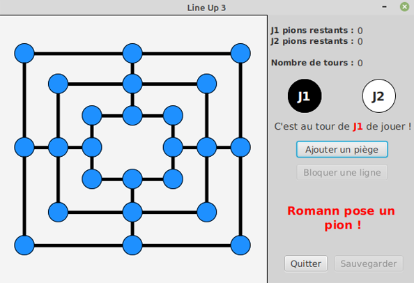
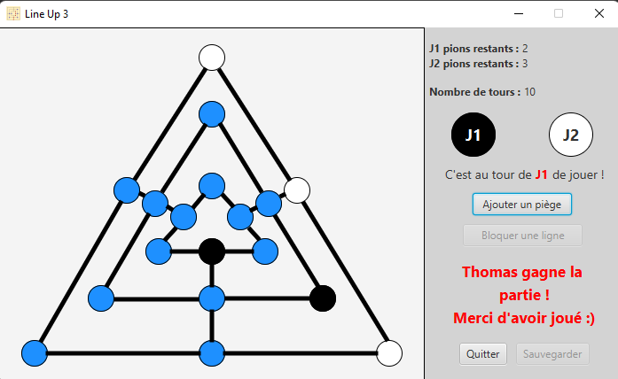

# ( Librairie nécessaire : JavaFX )

# Deux modes de jeu :

 - Graphique :
```
java --module-path "**lien vers le SDK JavaFX**\lib" --add-modules=javafx.controls,javafx.swing,javafx.fxml -jar "git\Jeu-Du-Moulin\graphique.jar"
```
 - Textuel :
```
java --module-path "**lien vers le SDK JavaFX**\lib" --add-modules=javafx.controls,javafx.swing,javafx.fxml -jar "git\Jeu-Du-Moulin\textuel.jar"
```

# Aperçu du projet





# Membres de l'équipe

 - Thomas Delattre
 - Romann Cornet

# UML

 L'UML est généré avec Object Aid

# Bon jeu :)
